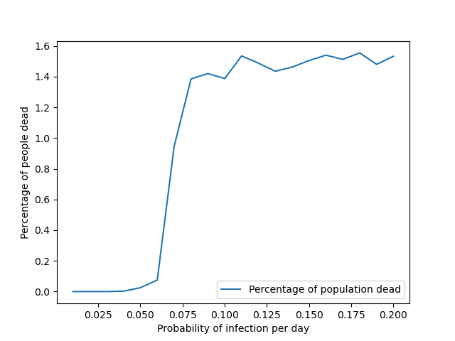
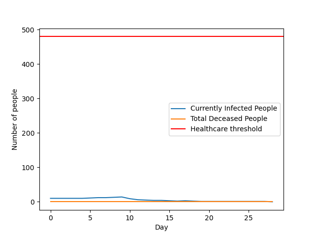
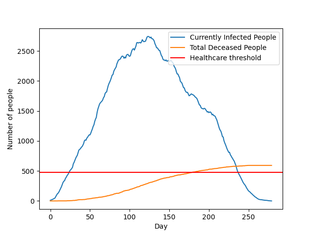

## Work of week 1

- Implemented the epidemical SIR model. To this end, we decided to use an OOP appproach where there are 2 basic classes: 'Simulation()' and 'Person()'. Within the SIR model, each person can only be Susceptible, Infected or Recovered. The model contains several parameters, which can be modified from the 'config.py' file. These parameters are

- - 'recovery_period': number of days it takes for an infected person to heal
- - 'inf_prob': probability of an infected person to transmit the disease to a susceptible person. In this first model we only consider transmission through Nearest Neighbours in the lattice
- - 'init_infected_ratio': ratio of initially infected people.

- People are arranged in a 2D lattice. One or more people are initially infected.

- In each time-step (day):
- - the nearest neighbours of an infected person are also infected with some probability.
- - the days to heal of each person decrease incrementally . If this reaches zero, the person is now Recovered and cannot not get infected or transmit the infection.  

- Visualization of the infection spread is also possible. Below we present the result: 

## Work of week 2

- Implemented the SIRD (Susceptible-Infected-Recovered-Deceased) model, so that now we account for deceased people. The probability of someone dying from the disease is given by 'total_death_prob'. Furthermore, we also take in account the amount of ICU beds available for treatment. If the number of people in need of ICU treatment is greater than the number of available ICU beds, then 'total_death_prob' is increased by a factor 'full_hospitals_worsening_factor'. 

- Studied the effects of the COVID measures on the model. The effect of the measures is modelled by decreasing the infection probability 'inf_prob' This is what one would get, for example, by imposing masks. In order to study how much does this probability needs to be reduced for the pandemic to be under control, we plot the percentage of deceased people  as a function of this probability, as presented below. We can see there is a transition phase around the critical probability 0.06. 

- Below we present the plots for the infected people and total deceased people per day for two values of probability of infection on both sides of the phase transition value. These are selected as 0.01 and 0.1. This can be seen as the difference between imposing and not imposing masks. 

- Below we present an animation of a run of the epidemic.

